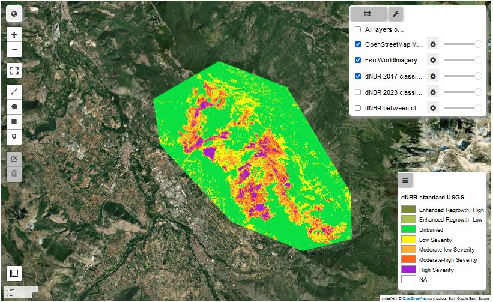
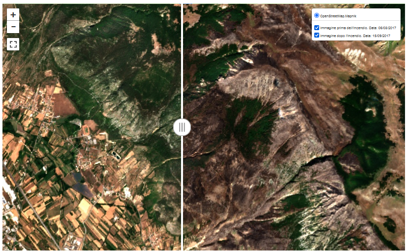

# Burn Severity Mapping via Sentinel-2 images
In this paper, a method for identifying fire-affected areas, and studying their degree of severity, has been proposed by using high-resolution satellite images such as those made available by the Sentinel-2 mission. It has been shown that NBR and dNBR indices were very useful in this purpose, but they showed criticality in the case of AOIs characterized by changes in vegetation or land cover, or deforestation. The use of GEE, thanks to the Cloud Computing paradigm, has made the processing of a large amount of satellite data possible, without criticality related to the computational capacity of the computer involved. Moreover, GEE APIs and Python libraries, allowed to implement the model by working in a Python environment.

